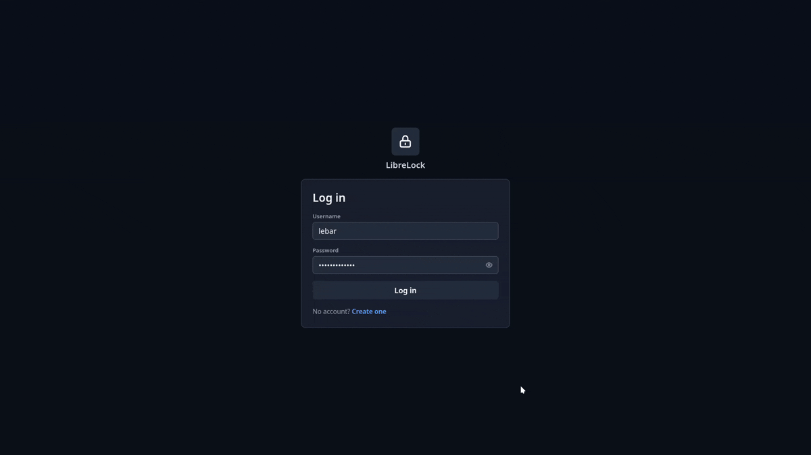

<div align="center">
  
  <h1 align="center">LibreLock</h1>
</div>

LibreLock is a secure, modern, self-hosted password manager. Manage your passwords, credit cards, and notes securely all in one place. Built for individuals and teams who value privacy and control over their data.

<div align="center">
  
</div>

## Features
- **Secure vault**: Securely store passwords, credit card details, and notes.
- **Client-side encryption**: All vault data is encrypted in the browser using AES-256-GCM before being sent to the server. The server stores only encrypted blobs and password hashes, none of which it can read. For more, see [Cryptography & Session Handling](../docs/cryptography.md).
- **Personal and organization mode**: Use LibreLock as a personal password manager or create an organization with multiple users, roles, and invite-only registration.
- **Password health monitoring**: Each password is checked against the [Have I Been Pwned](https://haveibeenpwned.com) breach database using k-anonymity. Passwords are also scored for strength and flagged if reused across multiple entries.
- **Categorization**: Organize your vault items into categories, assign them icons and colors for easy identification.
- **Export & import**: Export and import entire vault contents to a JSON file, protected with a password of your own.
- **Session management**: View all active sessions with device name, IP address, and last-used timestamp. Revoke individual sessions or all sessions at once from the settings page.
- **Light/dark theme**: toggle between light and dark mode; theme persistes in local storage.
- **Open source**: LibreLock is fully open source. You can self-host it on your own server or contribute to the project on GitHub.


## Get Started

The recommended way to run LibreLock is with Docker Compose. Clone [librelock-server](https://github.com/librelock/librelock-server) and [librelock-web](https://github.com/librelock/librelock-web), then run the provided `run` script from this repo to build and start both with one command:

```bash
git clone https://github.com/librelock/librelock-server.git
git clone https://github.com/librelock/librelock-web.git

# Linux/macOS
# Get the script from https://github.com/LibreLock/.github/blob/main/run.sh
chmod +x ./run.sh
./run.sh

# Windows (PowerShell)
# Get the script from https://github.com/LibreLock/.github/blob/main/run.ps1
./run.ps1
```

This copies `.env.example` to `.env`, then runs `docker compose up -d --build` for both projects. The web app is served at [localhost:1401](http://localhost:1401) and the API at [localhost:8000](http://localhost:8000). LibreLock uses a single embedded SQLite database (no separate database server to run), which is kept in a named volume (`sqlite_data`), so it persists across restarts and rebuilds.

A fresh instance always starts in **personal mode** - private, single-user vault, ready to use as-is. To run it as a team instance, sign in and switch to **organization mode** from Settings → Account → Switch to organization (no restart or config edit needed); the account you switch with becomes the owner. See [Organization Mode](../docs/organization.md) for details.

To stop everything, run `./run.sh down` (or `./run.ps1 down`). To completely tear down the stack (including the database volume!) run `./run.sh down -v` (or `./run.ps1 down -v`).

To run without Docker (requires Go and Node.js), use `run-local.sh` / `run-local.ps1` instead. This starts the API with `go run` and the web app with `npm run dev`, and stops both on Ctrl-C.

For details on running the backend or frontend individually, see the `README.md` in [librelock-server](https://github.com/librelock/librelock-server) and [librelock-web](https://github.com/librelock/librelock-web).

## Documentation

Guides live in [`docs/`](../docs/README.md):

- [Organization Mode](../docs/organization.md) — teams, roles (admin/member), user management, and invite-only registration.
- [Customization](../docs/customization.md) — white-label your instance with your own logo, company name, and support details.
- [Export & Import](../docs/export-import.md) — back up or move a vault: encrypted and plaintext backup files, how imports merge, and the file format.
- [Cryptography & Session Handling](../docs/cryptography.md) — client-side encryption, key wrapping, the authentication flow, and browser session handling.

## Tech Stack
- **Backend**: REST API built with [Go](https://go.dev/) and [Gin](https://gin-gonic.com/). Uses [SQLite](https://sqlite.org/)
- **Frontend**: Single-page application web application built with [Vue](https://vuejs.org/) and [Vite](https://vitejs.dev/).

## Security

LibreLock is end-to-end encrypted: vault data is encrypted in the browser with AES-256-GCM before it reaches the server, which only ever stores encrypted blobs and password hashes it cannot read. For the full design — key wrapping, the authentication flow, and how unlocked sessions are handled in the browser — see [Cryptography & Session Handling](../docs/cryptography.md).
